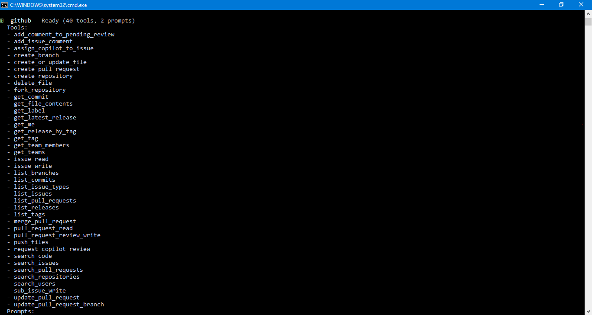
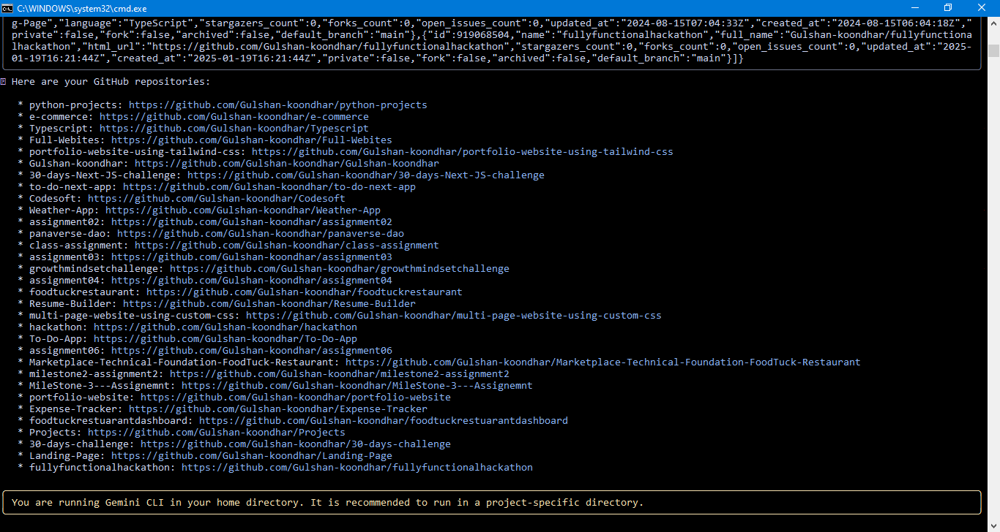

# Task 6 – GitHub × MCP Integration (Hosted Method) – Submission

I have successfully completed Task 6 of the AI-Driven Development 30-Day Challenge, which involved connecting the GitHub MCP Server with the Google Gemini CLI using the Hosted Integration Method.

### Below is my detailed task response:

### ✔️ Task Completion Summary

## 1️⃣ GitHub Personal Access Token (PAT) Created

I generated a new PAT from GitHub with the required permission:

- repo (Read + Write)
  The token was stored securely and not placed directly inside JSON.

## 2️⃣ Environment Setup

I created a .env file and added:

## 3️⃣ Gemini MCP Server Configuration

Inside .gemini/settings.json, I added the GitHub MCP server configuration:

## 4️⃣ Github /mcp list

Gemini responded with:

## 5️⃣ Github Repo list

Gemini successfully displayed all my repositories, proving that:

### 📎 Submission Items Prepared

I have attached the required screenshots:

- .env file (token blurred)
- settings.json configuration
- /mcp list showing “github — Ready”
- GitHub repo list output retrieved via Gemini
